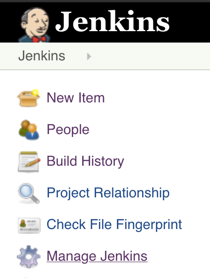
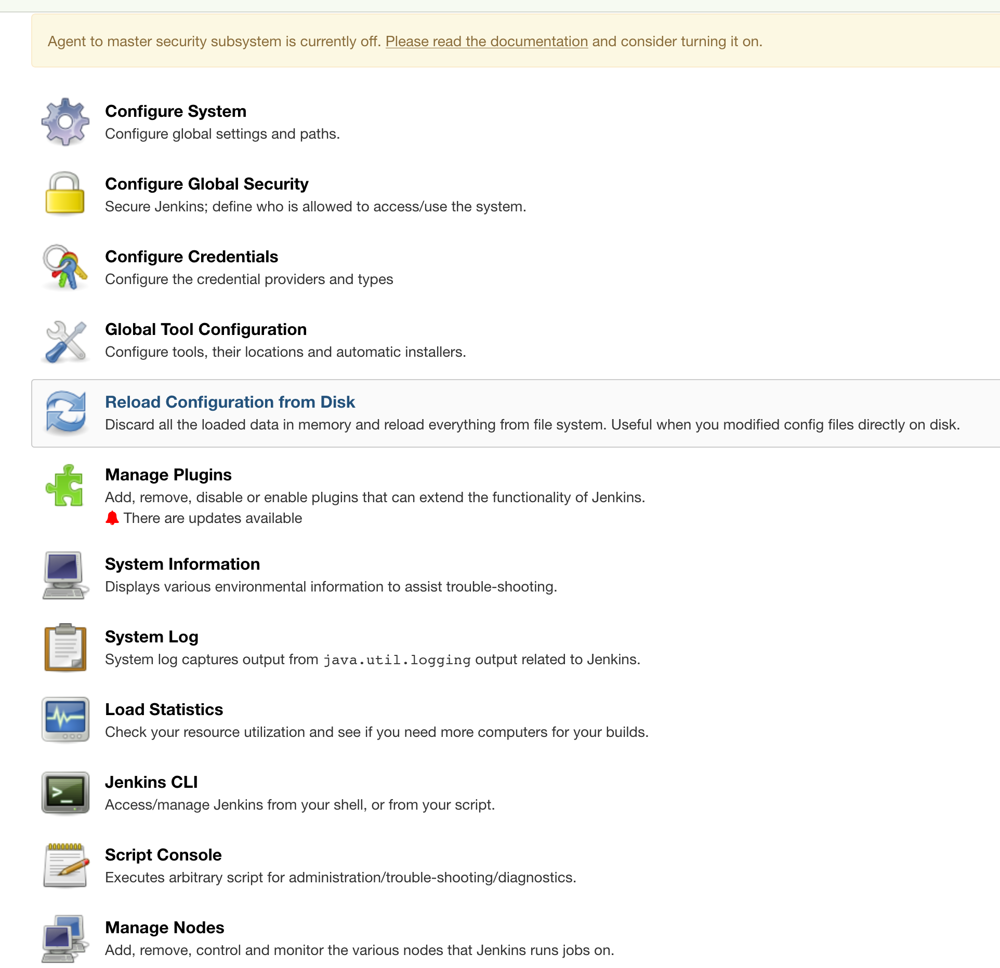
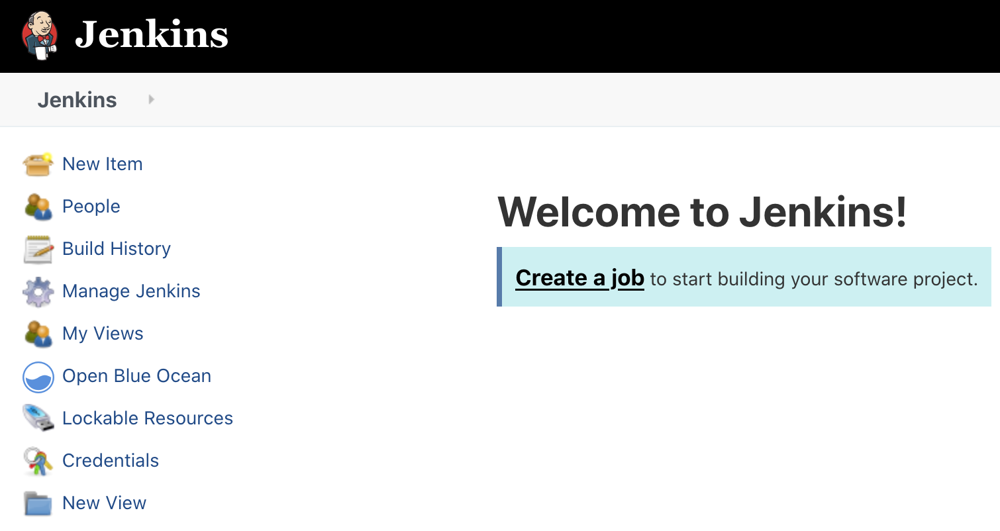
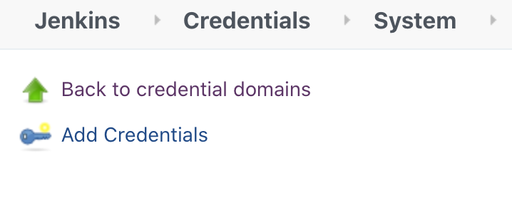
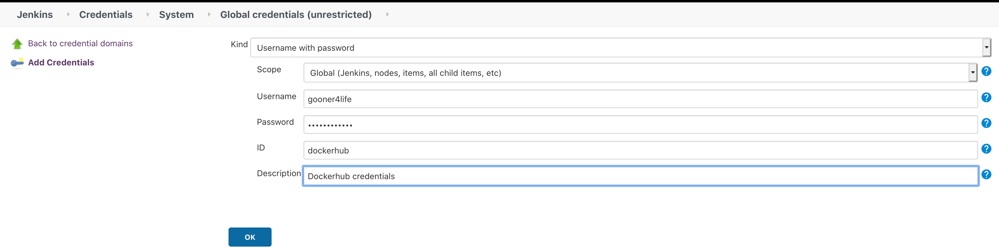
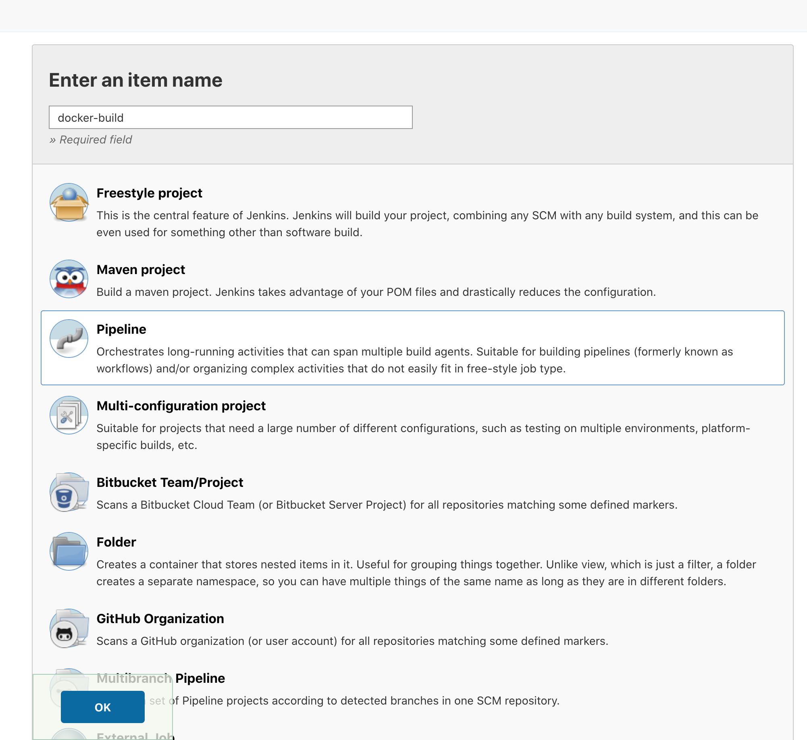
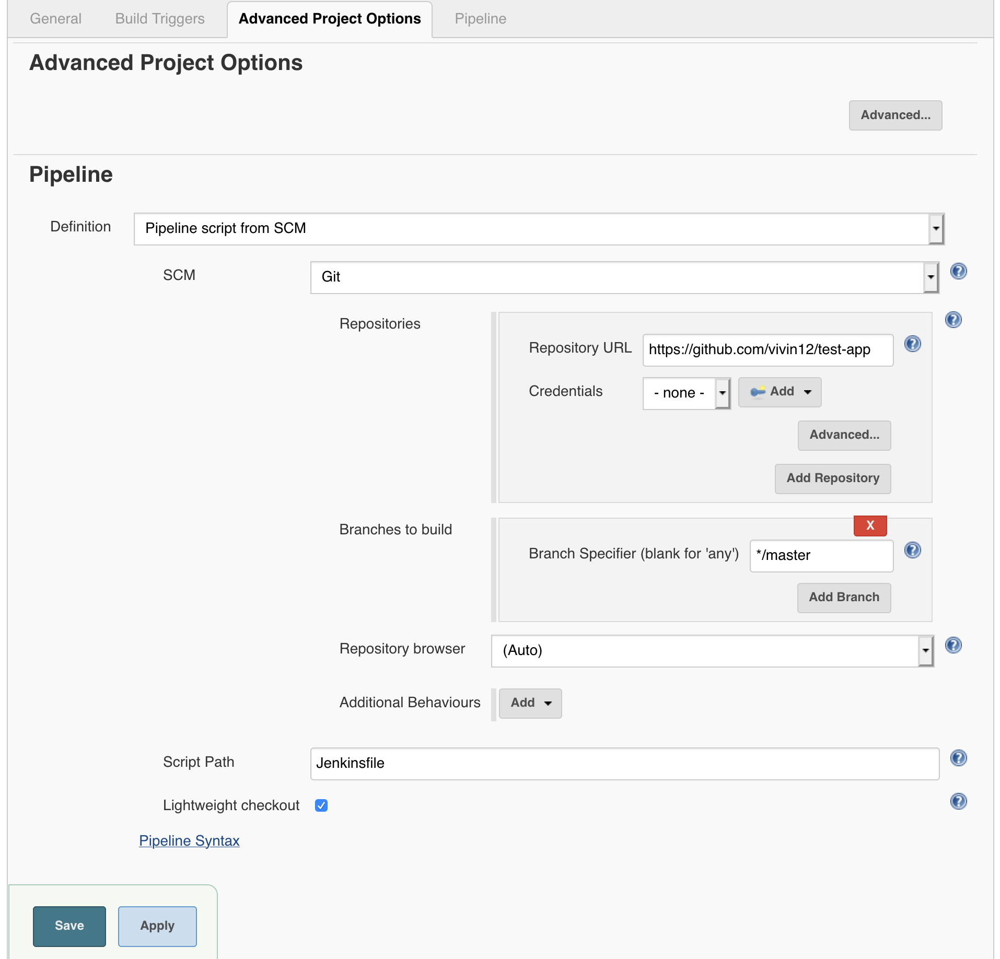
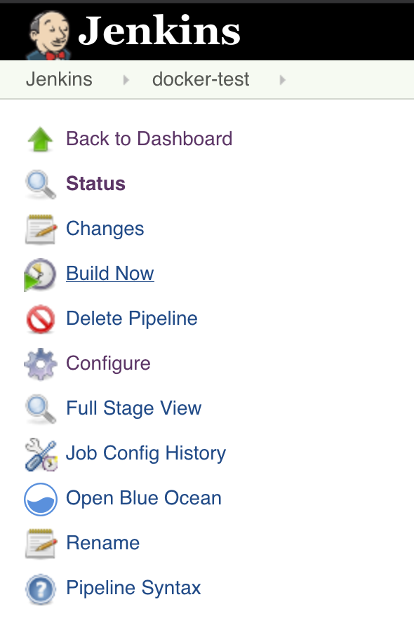

# Jenkins build example 

In the jenkins file script we have 4 different stages  
1. clone a git repo. 
2. Build the docker image. 
3. Push the docker image to dockerhub.
4. Remove the unused docker image.

### Running the script on Jenkins 

PRE-REQ: You need to have docker running on the Jenkins server.

#### Running Jenkins as a docker container 

1. I am using ```liatrio/jenkins-alpine``` image which already has docker installed on it. 
   we need to run the container with mounted docker daemon. Run the following command from your terminal

```docker run -p 8080:8080 -v /var/run/docker.sock:/var/run/docker.sock liatrio/jenkins-alpine```

NOTE: The docker daemon running on host machine must be compatible with docker client running in Jenkins container. 
check the version of the host with docker --version and install the appropriate version of docker client inside the Jenkins container.

2. To see the jenkins instance go to ```http://localhost:8080/```

#### Setting up Jenkins 

We need to 2 pre-req activities before we create our pipeline 
1. Install docker plugin 
2. Add docker credentials
 
##### Install docker plugin 
1. Click on manage Jenkins from Jenkins homepage 
    
    

2. Click on manage plugins, search for docker and install "docker" plugin
    
    

##### Add docker credentials
1. From Jenkins homepage click on credentials 
 
   

2. From credentials click on "Add credentials"
   
    

3. Fill the information. In the screenshot below i am adding credentials for my personal github. 
   Take a note of what you add as the "ID" as you will be referencing it in the Jenkinsfile.

    
    

#### Creating Jenkins pipeline 
1. From Jenkins homepage click on add "new-item" which will take you to the page where you can create a pipeline. 
    Give a name and select pipeline option and click ok.
    
    

2. Click on the advanced project options and from SCM select the repo where you have stored your Jenkinsfile and click save.

   

3. Fom the pipeline you created click on "Build Now" to start your pipeline build 
    
   


### Troubleshooting

1. If you get the below error, it might be a plugin mismatch. Go to manage jenkins, scroll down and click on manage 
    plugins. You can select all and update all the plugins or go through the list and select the ones that you want to update. 
    This seemed to fix the issue for me.  
   
    ```
    Running in Durability level: MAX_SURVIVABILITY
            java.lang.AbstractMethodError:org.jenkinsci.plugins.pipeline.modeldefinition.validator.ModelValidatorImpl.validateElement(Lorg/jenkinsci/plugins/pipeline/modeldefinition/ast/ModelASTStageBase;)Z
           at org.jenkinsci.plugins.pipeline.modeldefinition.ast.ModelASTStageBase.validate(ModelASTStageBase.java:49)
    ```
2. When you run the build and you get the below error message it means you haven't added the dockerhub credentials to jenkins. 
   Just follow the instructions given earlier to add dockerhub credentials to fix the issue. 

    ```[Pipeline] End of Pipeline
       ERROR: Could not find credentials matching dockerhub
       Finished: FAILURE
   ``` 
